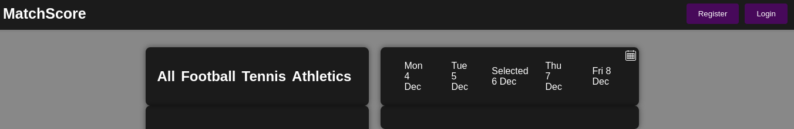
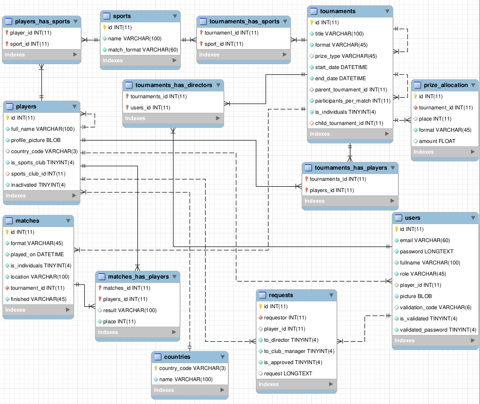

# MatchScore - organise, manage and explore tournaments and leagues

# Welcome!
### This application provides a friendly interface for creating, managing or just observing sports events and their statistics.
#### The backend is developed in Python using Fast API, and for the frontend Jinja2 library is used to create a nice and intuitive UI.
---
---
### Brief functionality of the app:
```
Without registration you can:

 - explore all the tournaments by the interactive calendar in the landing page
 - view all the matches associated with every tournament
 - view detailed statistics for the tournaments, matches and for every player who took part 
 in a tournament
 - available sports at this point are football, tennis and athletics

With registration, depending on your user role you can:

 - manage your profile - upload a profile picture, link your profile to a player in the system
 - request to be promoted to "director" so you can manage events and profiles of existing players
 - create or remove players in the system
 - add players to sports clubs
 - create tournaments in three formats - knockout, league or single
 - add players/sports clubs to the tournaments, depending on the chosen format and the selected 
 sport
 - option to add prizes for the winners
 - edit the matches locations and played-on dates
 - edit the participants list of a single event
 - add results for every match
```

#### The app is not deployed on a remote container so it requres to be cloned locally and configured in order to work. Detailed instructions for setting up the app and installing the required packages can be found below.

---
---

### Detailed description of the app and its functionality:

<p align="center">

</p>

```
- When the server is started and you enter the url http://127.0.0.1:8000/ in the browser, 
the MatchScore landing page will be loaded.
- If you want to see the created tournaments, you can click on any tournament in the dedicated 
section. You can filter them by sport or you can select a date from the calendar to check if 
there are any events on this day.
- On the top right side the buttons for login and registration can be found.
    - If you already have an account in the system, just login with your username and password. 
    You will remain logged so you don't have to login every time you visit the site.
- The other option is to register in the system: 
    - You will be asked to provide a name, a strong password and a valid email address.
    - The email should be valid, because when you click registed we will send you a validation 
    code on this email. Be sure to check the Spam folder in your mailbox if you don't see the 
    message in the Inbox folder. 
    - For security reasons your profile will be created only after you provide the provided 
    validation code.
- By default your profile role will be "player" and will have a pictogram as default picture.
- If you want you can upload a new profile picture.
- If you want your profile to be linked to a participant profile in the system you can send a 
request from your dashboard.
- The benefit of that is that your picture will be shown when you or someone else views your 
statistics or when you appear as a participant in a match.
- If you want to be able to create events, manage the matches, adding scores or manage player 
profiles, from your dashboard you can send a request to be promoted to "director". When your 
request is approved by an admin, you will have the extended functionality which directors have.
```    
```
- Creating tournaments:
```


